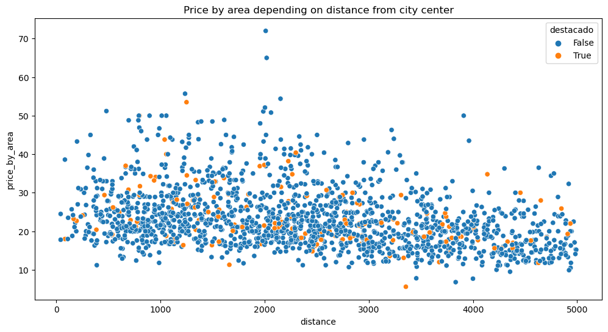
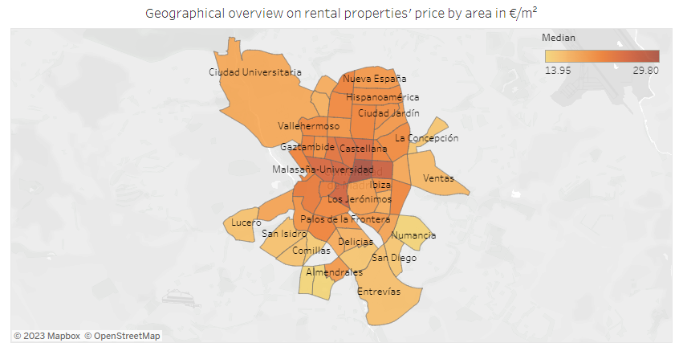

# Explore real estate data for Madrid using idealista

*Picture retrieved on 05.11.2023 from https://pixabay.com/de/photos/madrid-spanien-sonnenuntergang-2714570/ by Stan89, license: https://pixabay.com/de/service/license-summary/*

The goal of this project is to analyze rental prices in Madrid across different neighborhoods, as well as to identify features that explain differences in prices and to visualize price developments over time. 
The data is taken from the idealista API (access can be requested here: https://developers.idealista.com/access-request (link last used on 04.11.2023)).

## First analysis results

*Scatterplot of prices by area in €/m² versus distance from city center. Screenshot from exploratory analysis: analysis/Exploratory_analysis.ipynb* 

Key results of an exploratory analysis conducted on the first three weeks of data (10.11.-25.11.2023, around 1670 data points) include:
* The median price per area for properties in a 5km radius around the city center is **21.9 €/m2** (versus 24.2 €/m2 in the centre). The mean price is slightly higher (23.3 €/m2 versus 25.5 €/m2 in the centre), indicating that there are some outliers in the higher price range.
* The median price is around **1700 €**.
* The median size is **80 m²**.
* Features that were identified for further analysis include: 
  - floor
  - exterior (True/False)
  - furnished (True/False)
  - neighborhood
  - distance from city center.

Furthermore, I inspected the data quality (missing values, duplicates, outliers, etc.) and did not find any major issues.

## Tableau dashboard

*Screenshot from Tableau dashboard (13.12.2023)*

Based on these results, I implemented an interactive dashboard on Tableau public: https://public.tableau.com/app/profile/janina.schuhmacher/viz/RentalpricesinMadrid/overview?publish=yes. It includes an overview on the different neighborhoods (see screenshot above), a visual analysis of different features as well as an overview on how many properties have a price below x€/m².

## About the data

Filters that I always apply are:
* country=es
* operation=rent
* propertyType=homes
* center=40.416944,-3.703333 (for Madrid city center)
* distance=5000 (for a radius of 5 km aroud the center)
* hasMultimedia=True (meaning property has pictures, a video or a virtual tour)
* preservation=good
* maxItems=50 (items per page, max. 50)
* numPage (page number, we iterate through the pages)
* minPrice=200 (minimum rent)
* minSize=40 (minimum size of the flat in m2)
* sinceDate=W (W:last week, M: last month, T:last day (for rent except rooms), Y: last 2 days (sale and rooms))
* order=ratioeurm2 (distance, price, street, photos, publicationDate, modificationDate, size, floor, rooms, ratioeurm2)
* sort=asc (ascending or descending)

Other relevant filters include:
* furnished (furnished or furnishedKitchen if there is only a kitchen)

Filters that are currently not used are:
* locationId=0-EU-ES-28 (for Madrid, Spain)
* airConditioning (boolean, whether the flat has air conditioning)
* maxPrice (maximum rent)
* maxSize (maximum size of the flat, from 60 m2 to 1000m2)
* bedrooms (0,1,2,3,4: , bedroom number separated by commas. examples: "0", "1,4","0,3", "0,2,4". 4 means "4 or more")

